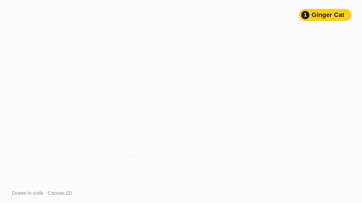
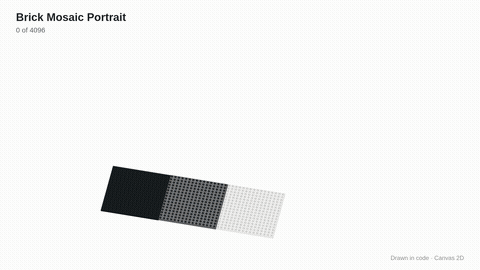
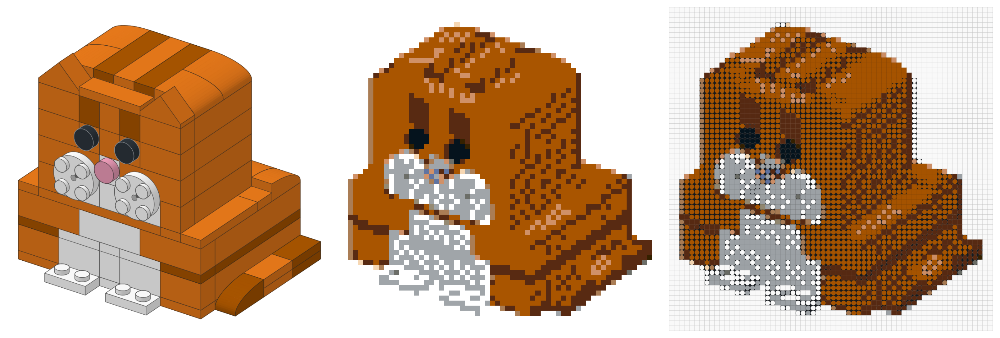
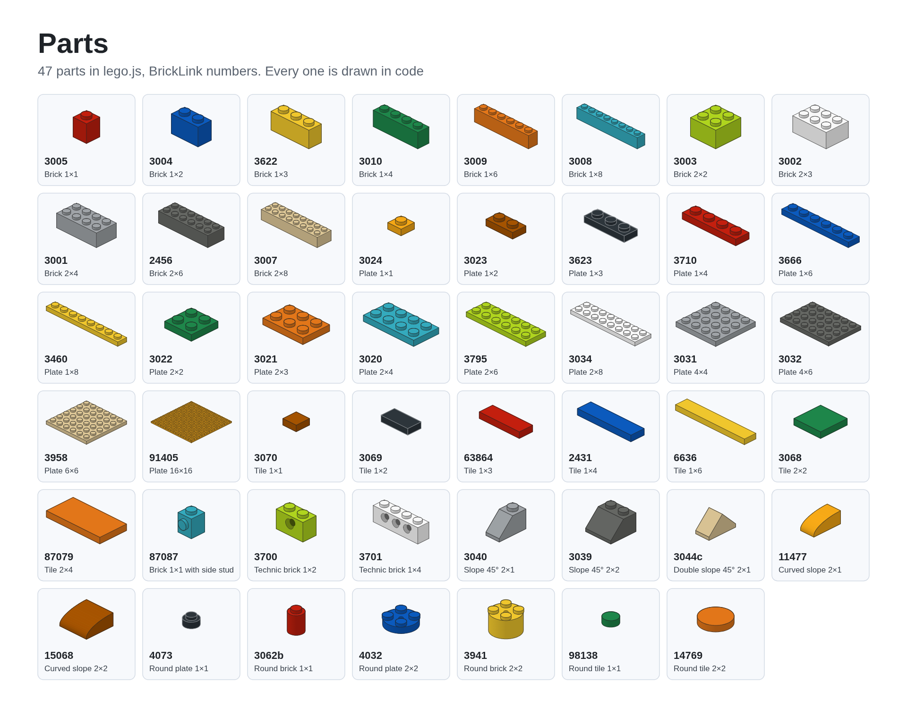

# lego-build



LEGO assembly animations in the style of an official instruction booklet. Every frame is drawn in code on Canvas 2D: no images, no 3D models, no 3D engine. A model is a list of steps, and the engine draws the instruction page with the parts list, step number, falling bricks and a yellow outline on new parts, then spins the finished model at the end.

Included example: a ginger cat in 106 real parts. Every part + colour pair is checked against the BrickLink catalogue, the face hangs on side-stud bricks, and there are no prints.

Ready-made videos are in `media`: vertical [cat.mp4](media/cat.mp4) and horizontal [cat-16x9.mp4](media/cat-16x9.mp4).

## Preview

Open `index.html` in a browser. Space or click pauses, arrow keys step one frame.

- `index.html?format=horizontal` horizontal 1920×1080
- `index.html?model=microduck` second example, a mini robot
- `index.html?view=parts` catalogue of all 47 parts
- `index.html?t=12` open at 12 seconds

## Render a video

Needs Node.js 18+ and ffmpeg.

```bash
npm install
npx playwright install chromium
node tools/render.cjs --model cat
node tools/render.cjs --model cat --format horizontal
```

Videos appear in `exports`.

## Portrait from a photo



A photo becomes a mosaic of 1×1 round and square tiles on black 16×16 plates, like LEGO Art sets. One stud is one pixel, and every cell gets a real tile in a colour that is actually produced. Colours are matched the way the eye sees them (CIELAB, CIEDE2000). The palette is fitted to the photo, neighbouring tiles dither into in-between tones, and isolated dots are cleaned up. Black-and-white photos are detected and built from four greys.

Outputs: an image, a build map with a colour number on every stud, a parts list with BrickLink numbers, and a video. In the video the camera flies along the build front and ends above the portrait with the photo alongside.

```bash
node tools/mosaic.cjs photo.jpg --size 80 --video
node tools/mosaic.cjs photo.jpg --video --format vertical
node tools/mosaic.cjs photo.jpg --frames 3,9,15
```

| Flag | What it does | Default |
|---|---|---|
| `--size` | mosaic side in studs, multiple of 16 | 64 |
| `--shape` | `mixed` round and square, `round` LEGO Art style, `square` | mixed |
| `--palette` | `portrait` calm colours, `all` every tile colour | portrait |
| `--colors` | how many colours to use | 12 |
| `--dither` | blending between neighbouring tiles, 0 to 1 | 0.5 |
| `--contrast`, `--sharpen` | tone stretch and feature sharpness, 0 to 1 | 0.5 |
| `--zoom`, `--dx`, `--dy` | face framing | 1, 0, 0 |

Or open `mosaic.html`, drop in a photo and tune the same settings in the browser. You can download the image, build map and video from there. The photo never leaves your machine.



## PileBuild: from a photo of loose bricks to a build

**Live:** [hampshire33.github.io/LOGO](https://hampshire33.github.io/LOGO/) · [instruction player](https://hampshire33.github.io/LOGO/player.html) · [photo mosaic](https://hampshire33.github.io/LOGO/mosaic.html)

Open `app.html`. Photograph your loose bricks and PileBuild:

1. **Finds each piece** in the photo (`src/detect.js`, no network needed; spread pieces so none touch).
2. **Identifies them** into an editable parts list. On claude.ai, Claude reads the whole photo; on a standalone site, each detected piece is sent to [Brickognize](https://brickognize.com/). You can always add or fix rows by hand.
3. **Suggests builds**: a sturdy striped stack generated from your own bricks and plates, how much of each ready-made model you already own (with a missing-parts list), and, on claude.ai, Claude ideas designed only from your parts. Add a second photo of what you want (a pet, a car) and Claude designs that instead.
4. **Plays the instructions** with the booklet engine. Every model is checked for overlapping and loose parts (`src/check.js`, the same check as `tools/check-model.cjs`). "Copy model file" gives you a `src/models/*.js` file to render to video.

`node tools/build-app.cjs` bundles the app into one file: `dist/app.html` for any web host, `dist/app.artifact.html` for publishing as a claude.ai artifact.

## Your own model

1. Copy `src/models/cat.js` to `src/models/<name>.js` and change the steps.
2. Add `<script src="src/models/<name>.js"></script>` to `index.html`.
3. Check it with `node tools/check-model.cjs <name>`. It finds intersecting parts and parts that aren't held by anything.
4. Open `index.html?model=<name>` and render the video.

Coordinates, side-stud mounting and common mistakes are in [reference/modeling.md](reference/modeling.md); all parts and colours are in [reference/parts.md](reference/parts.md).

## Agent skill

The whole folder is a skill for Claude Code and other agents that support SKILL.md:

```bash
git clone https://github.com/Hampshire33/LOGO ~/.claude/skills/lego-build
```

Then just ask, e.g. "build an owl out of LEGO and make a horizontal video". The agent designs the model from real parts, checks colours against the catalogue, runs the check and renders the video. Agent instructions are in [SKILL.md](SKILL.md).

## Parts



## Credits

Based on [siliconbag/lego-build](https://github.com/siliconbag/lego-build) (MIT), translated to English. The original's style was inspired by the fan-made [Microduck](https://huggingface.co/buckets/victor/microduck-lego-booklet) booklet, a LEGO model of the Pollen Robotics robot in 1,113 parts.

LEGO is a trademark of the LEGO Group, which does not sponsor or endorse this project. Models are verified on screen only; nobody has built them physically.

## Licence

MIT, see [LICENSE](LICENSE).
